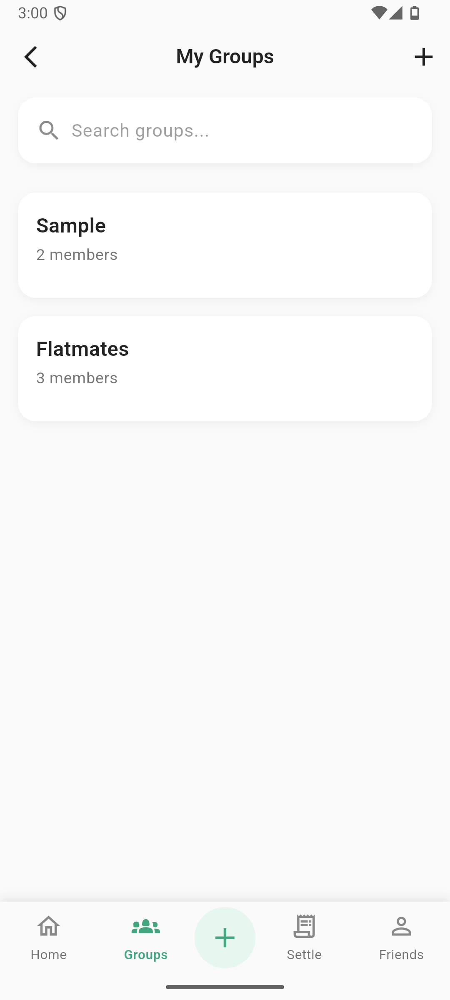

# PerSplit 💸

### Smart Expense Splitting & Management Application

PerSplit is a **full-stack expense splitting and management platform** designed to simplify shared expense tracking between friends, roommates, and groups.

It provides **accurate expense splitting, real-time updates, secure payments, and optimized settlements** through a modern mobile interface built with **Flutter** and a scalable backend powered by **Node.js, Express, and MongoDB**.

---

# 📱 App Preview

<p align="center">



</p>

---

# 🚀 Features

### 1️⃣ Secure Authentication

* JWT based authentication
* Encrypted passwords using **bcrypt**
* Secure login & session management

### 2️⃣ Friend Management

* Send / Accept friend requests
* Manage trusted contacts
* Organize shared expenses easily

### 3️⃣ Group Expense Splitting

* Create groups
* Add/remove members
* Track group expenses
* Multiple split options:

  * Equal split
  * Percentage split
  * Custom split

### 4️⃣ Expense Tracking

* Record personal or group expenses
* Automatic share calculation
* Accurate **paise-precision settlement**

### 5️⃣ Payment & Settlement

* UPI based settlement
* QR code payments
* Payment verification workflow

### 6️⃣ Optimized Net Settlement

PerSplit calculates **minimum transactions required** to clear debts using optimized settlement algorithms.

### 7️⃣ Real-Time Notifications

* WebSocket based notifications
* Instant updates for:

  * expenses
  * settlements
  * friend requests
  * payments

---

# 🧠 Problem Statement

Many existing expense apps are:

* Complex to use
* Lack UPI integration
* Do not support regional payment systems
* Require manual calculations

PerSplit solves this by providing **simple UI, automated calculations, and real-time collaboration.**

---

# 🏗 System Architecture

```
Flutter Mobile App
        │
        │ REST API + WebSocket
        ▼
Node.js + Express Backend
        │
        ▼
MongoDB Database
```

Additional components:

* **JWT Authentication**
* **Socket.IO** for real-time updates
* **UPI integration for settlements**

---

# 🧰 Tech Stack

### Frontend

* Flutter
* Dart

### Backend

* Node.js
* Express.js

### Database

* MongoDB

### Security

* JWT Authentication
* bcrypt password hashing

### Real-time

* Socket.IO

### Version Control

* Git
* GitHub

---

# 📂 Project Structure

```
persplit
│
├── src                 # Node.js backend
│   ├── controllers
│   ├── routes
│   ├── models
│   ├── middleware
│   └── utils
│
├── persplitApp         # Flutter mobile application
│   ├── lib
│   │   ├── pages
│   │   ├── services
│   │   └── routes
│   └── assets
│
├── README.md
└── package.json
```

---

# ⚙️ Installation & Setup

## 1️⃣ Clone the repository

```bash
git clone https://github.com/yourusername/persplit.git
cd persplit
```

---

## 2️⃣ Backend Setup

```bash
npm install
```

Create `.env`

```
PORT=5000
MONGO_URI=your_mongodb_uri
JWT_SECRET=your_secret_key
```

Run server

```bash
npm start
```

---

## 3️⃣ Flutter App Setup

```
cd persplitApp
flutter pub get
flutter run
```

---

# 📊 Performance

* API response time: **120–200 ms**
* MongoDB query time: **< 50 ms**
* Real-time notification latency: **< 1 second**

---

# 🧪 Testing

The system includes:

* Input validation
* Rate limiting
* JWT security tests
* End-to-end workflow testing

User flows tested:

* Login
* Add expense
* Split expenses
* Payment settlement
* Notification system

---

# 🔮 Future Improvements

* Recurring expenses
* Offline mode
* Analytics dashboard
* Multi-currency support
* CSV / Excel export
* Enhanced social features
* Accessibility improvements

---

# 👨‍💻 Author

**Brijesh Kumar**

B.Tech – Faculty of Technology
University of Delhi

GitHub: https://github.com/yourusername

---

# ⭐ Support

If you like this project:

⭐ Star the repository
🍴 Fork the project
🐛 Report issues

---

# 📜 License

This project is licensed under the **MIT License**.
