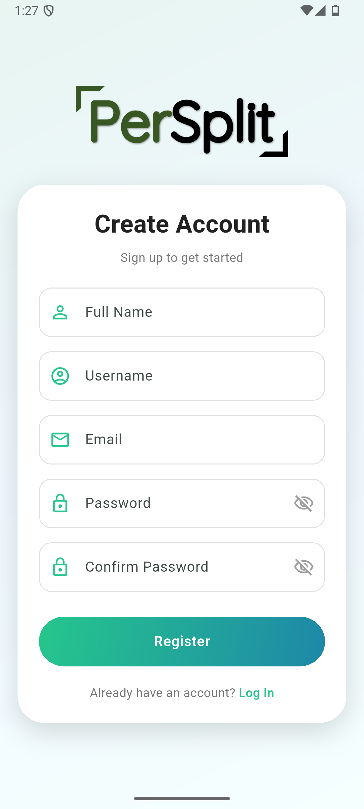
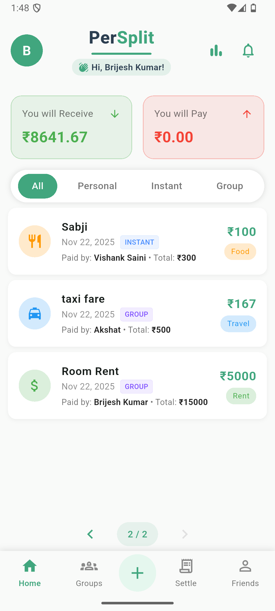
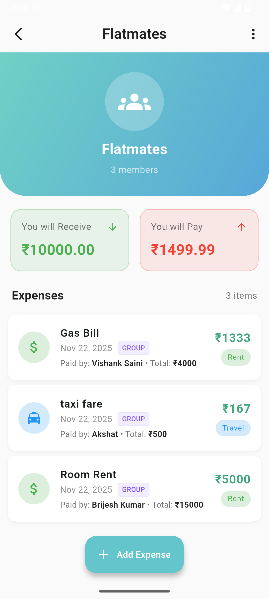
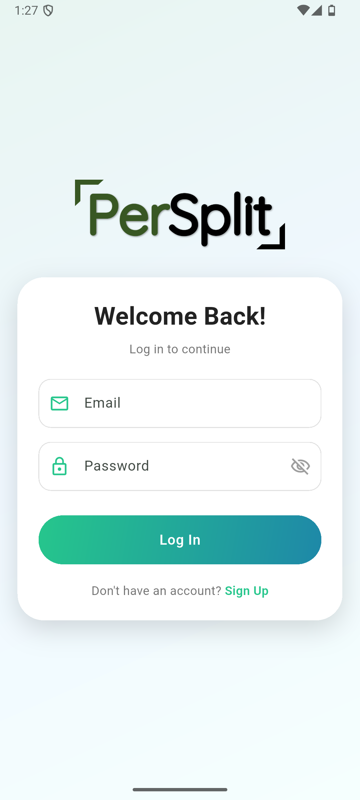
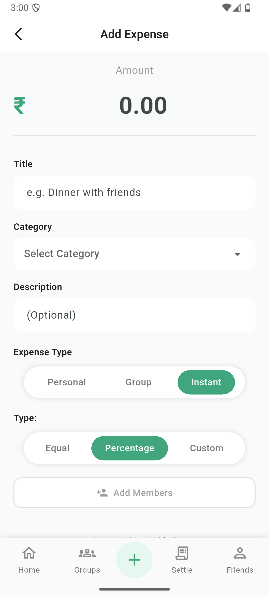
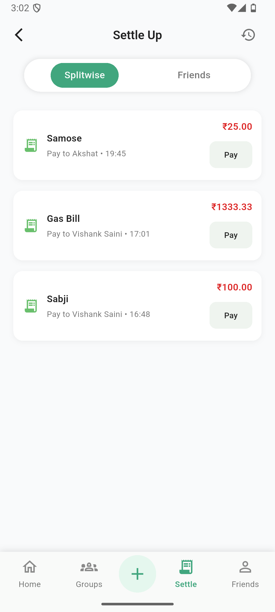
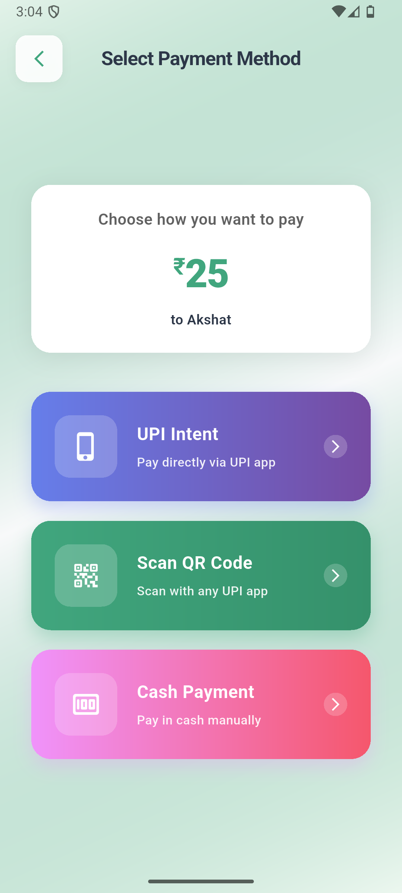
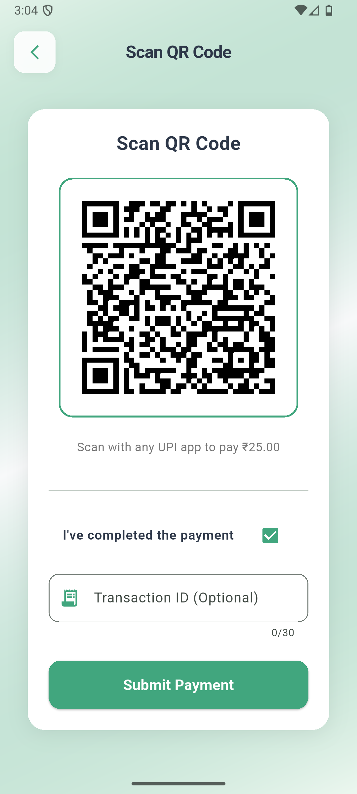
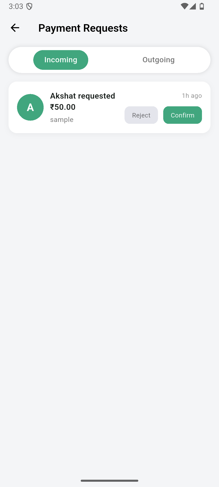

# PerSplit

**PerSplit** is a full-stack expense splitting and management platform designed to simplify shared financial tracking among friends, roommates, and groups. The system provides accurate expense splitting, real-time updates, and optimized settlements through a modern mobile interface built with Flutter and a scalable backend powered by Node.js, Express, and MongoDB.

The goal of the project is to provide a lightweight yet powerful alternative to traditional expense sharing applications by combining automated calculations, secure authentication, and collaborative real-time updates.

---

# Application Preview

## Home & Expense Dashboard

<p align="center">



</p>

The dashboard provides an overview of balances, recent transactions, and quick access to core features such as adding expenses and settling payments.

---

## Expense Entry & Split Configuration

<p align="center">



</p>

Users can record expenses with flexible splitting methods including equal splits, percentage splits, and custom allocations.

---

## Authentication & Payment

<p align="center">



</p>

The platform supports secure account creation, authentication, and integrated settlement workflows including QR-based payments.

---

# Problem Statement

Many existing expense sharing platforms suffer from several limitations:

* Complex interfaces that are difficult for casual users
* Limited integration with regional payment systems
* Lack of real-time updates between participants
* Manual or inaccurate split calculations
* Poor support for group collaboration

PerSplit addresses these challenges by providing a streamlined system with automated calculations, integrated payment workflows, and real-time collaboration.

---

# Key Features

## Secure User Authentication

* JWT based authentication
* Password hashing using bcrypt
* Secure session handling

## Friend and Group Management

* Send and accept friend requests
* Create and manage groups
* Add or remove group members
* Organize expenses within trusted networks

## Comprehensive Expense Tracking

* Personal and group expenses
* Equal, percentage, and custom splitting
* Automatic balance updates

## Payment and Settlement

* Integrated payment recording
* QR based settlement workflow
* Transaction verification

## Optimized Net Settlement

The system calculates minimal transactions required to settle all balances across a group, reducing unnecessary transfers.

## Real-Time Notifications

* WebSocket powered updates
* Instant notifications for expenses, payments, and settlements

---

# System Architecture

The system follows a modular full-stack architecture separating the client application, API layer, and database.

```
Flutter Mobile Client
        │
        │ REST API / WebSocket
        ▼
Node.js + Express Server
        │
        ▼
MongoDB Database
```

**Additional Components**

* JWT authentication layer
* Socket.IO real-time communication
* RESTful API services
* Secure middleware validation

---

# Technology Stack

## Frontend

* Flutter
* Dart

## Backend

* Node.js
* Express.js

## Database

* MongoDB

## Real-time Communication

* Socket.IO

## Security

* JWT authentication
* bcrypt password hashing

## Development Tools

* Git
* GitHub
* REST APIs

---

# Project Structure

```
persplit
│
├── src                     # Backend application
│   ├── controllers
│   ├── routes
│   ├── models
│   ├── middleware
│   ├── validators
│   └── utils
│
├── persplitApp             # Flutter mobile application
│   ├── lib
│   │   ├── pages
│   │   ├── services
│   │   ├── routes
│   │   └── utils
│   │
│   └── assets
│
├── package.json
└── README.md
```

---

# Installation

## Clone Repository

```
git clone https://github.com/brijeshkumarmorya/persplit.git
cd persplit
```

---

# Backend Setup

Install dependencies:

```
npm install
```

Create an environment configuration file:

```
PORT=5000
MONGO_URI=your_mongodb_connection
JWT_SECRET=your_jwt_secret
```

Run the server:

```
npm start
```

---

# Mobile Application Setup

Navigate to the Flutter project:

```
cd persplitApp
```

Install dependencies:

```
flutter pub get
```

Run the application:

```
flutter run
```

---

# Performance and Testing

System testing included validation of all critical workflows:

* Authentication and authorization
* Expense creation and splitting
* Payment verification
* Group management
* Notification delivery

Observed performance metrics:

* API response time: 120–200 ms
* MongoDB query latency: under 50 ms
* Real-time notification latency: under 1 second

---

# Future Enhancements

Planned improvements include:

* Recurring expense automation
* Offline expense tracking
* Financial analytics and visual reports
* Multi-currency support
* Export functionality for reporting
* Enhanced collaboration features
* Accessibility improvements

---

# Author

Brijesh Kumar Morya\
Bachelor of Technology\
Faculty of Technology, University of Delhi

---
